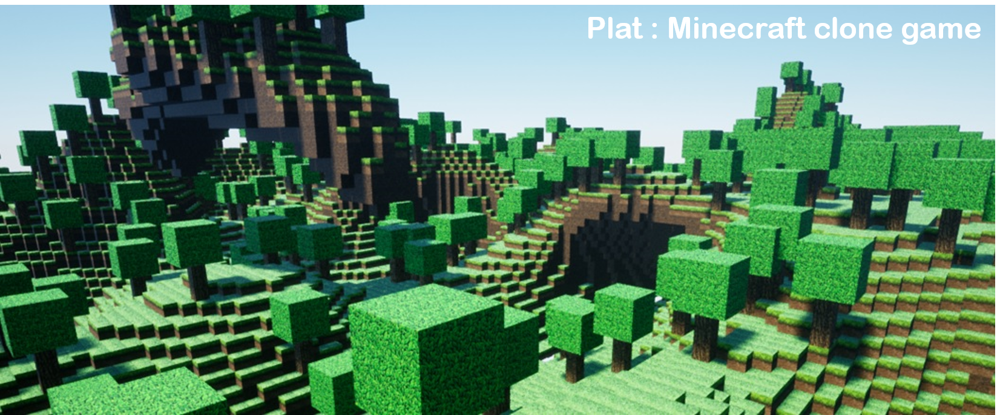

# Plat

## 1. Overview

__Plat is a minecraft clone project using unreal engine.__

Plat focus on how to handle a huge world to make players feel like they belong to the infinite world. Also, It has other features to satisfy seems like minecraft. These are describe `features` section.

## 2. Features

- The world consists of blocks you can interact with.
- Support item combination recipes.
- Player can equip some items and it makes little changes when you interact with specific blocks.

## 3. Perlin noise

Perlin noise is the key algorithm for creating terrain. I have an aim to achieve that code the algorithm myself. You can find source code in `WorldMap`.

> #### reference
>
> > * <https://adrianb.io/2014/08/09/perlinnoise.html>
> > * <https://solarianprogrammer.com/2012/07/18/perlin-noise-cpp-11/>
> > * <https://www.youtube.com/watch?v=6-0UaeJBumA>
> > * https://www.youtube.com/watch?v=MJ3bvCkHJtE&t=4s

## Mesh source

steve(character):https://sketchfab.com/3d-models/the-perfect-steve-rigged-0cffc39bdab04551bde4f8cdfbc52eca

weapons:https://www.turbosquid.com/3d-models/free-sword-shovel-axe-3d-model/1006797

